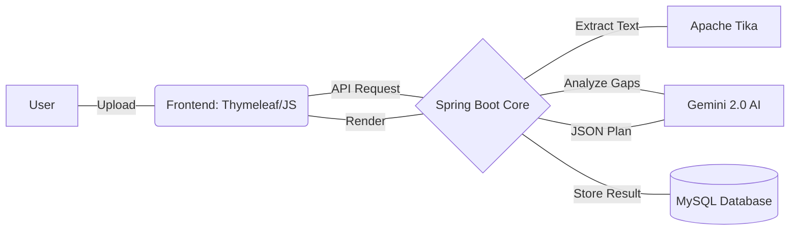

<div align="center">
  
  
  
  
</div>

# AI SkillBridge 🚀

**An AI-powered career growth platform that identifies skill gaps and generates personalized study plans.**

---

## 🔗 Live Demo
> [!IMPORTANT]
> **Experience the AI-driven career pathing live!**
> ## [🚀 Launch AI SkillBridge Platform](https://ai-skill-bridge-production.up.railway.app)

---

## 📝 Problem Statement
Traditional job applications create a "black box" where candidates don't know why they were rejected. Identifying the specific technical gaps between a resume and a job description is time-consuming and difficult. 

**AI SkillBridge** bridges this gap by:
- **Instant Analysis**: Comparing PDF/DOCX resumes against Job Descriptions in seconds.
- **Prioritized Roadmap**: Identifying not just "what's missing," but what's *most critical* to learn.
- **Actionable Execution**: Turning gaps into a structured, day-wise study plan.

---

## 🏗️ Architecture Diagram
*A clean, efficient full-stack architecture designed for AI-driven insights.*



---

## 🌟 Features
- **🔍 AI Gap Analysis**: Real-time extraction and comparison of technical skills.
- **📅 Study Plan Generator**: Custom, day-by-day schedules tailored to your timeline.
- **🛡️ 100% Availability**: Rule-based fallback system for when AI services are offline.
- **📄 Multi-Format Support**: High-fidelity parsing of PDF, Word, and Text files.
- **✨ Luxury Dark UI**: Modern glassmorphism design for a premium user experience.
- **📊 Persistent History**: Track your progress and review past analyses anytime.

---

## 🛠️ Tech Stack
| Category | Technologies |
| :--- | :--- |
| **Backend** | Java 17, Spring Boot 3.2.5, Spring Data JPA |
| **Frontend** | Thymeleaf, Vanilla CSS3, JavaScript (ES6+) |
| **AI & ML** | Google Gemini 2.0 (via OpenRouter API) |
| **Data & Storage** | MySQL 8.0, Apache Tika (Parsing) |
| **Infrastructure** | Docker, Railway, Swagger (OpenAPI 3) |

---

## 🚀 Installation Steps

### 1. Prerequisites
- **JDK 17+**
- **MySQL 8.0+**
- **OpenRouter/Gemini API Key**

### 2. Local Setup
1. **Clone the repository**:
   ```bash
   git clone https://github.com/dilipnalage1063/AI-Skill-Bridge.git
   cd AI-Skill-Bridge
   ```
2. **Set Environment Variables**:
   ```bash
   # Add your OpenRouter/Gemini key
   export OPENROUTER_API_KEY='your_key_here'
   # Configure DB details
   export SPRING_DATASOURCE_URL='jdbc:mysql://localhost:3306/studydb'
   export SPRING_DATASOURCE_USERNAME='root'
   export SPRING_DATASOURCE_PASSWORD='your_password'
   ```
3. **Build & Run**:
   ```bash
   ./mvnw clean spring-boot:run
   ```

---

## 📄 License
Distributed under the MIT License. See [LICENSE](LICENSE) for more information.
© 2026 **[Dilip Nalage](https://github.com/dilipnalage1063)**.
